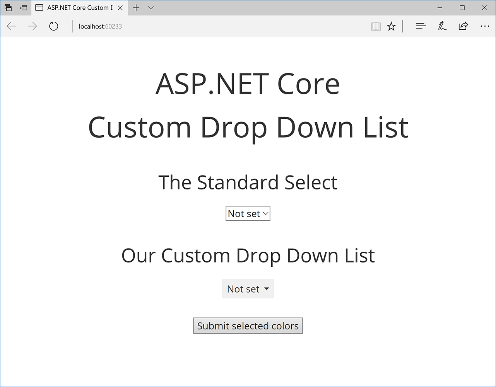

# ASP.NET Core Custom Drop Down List
This is a demo web application for the
“[ASP.NET Core Custom Drop Down List](https://medium.com/@dmitrysikorsky/asp-net-core-custom-drop-down-list-86bcd60f2cf2)”
post on the [Dmitry Sikorsky’s blog](https://medium.com/@dmitrysikorsky). It demonstrates how to build custom drop down list
on ASP.NET Core using tag helper.

The result looks like this:

*Custom drop down list*

Updated to use .NET Core 2.0.

## Using the Application

1. Run the application.
2. Try to select the values in the standard select and custom drop down list controls.
